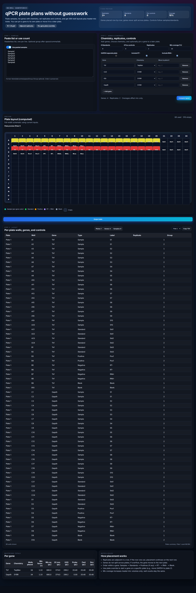
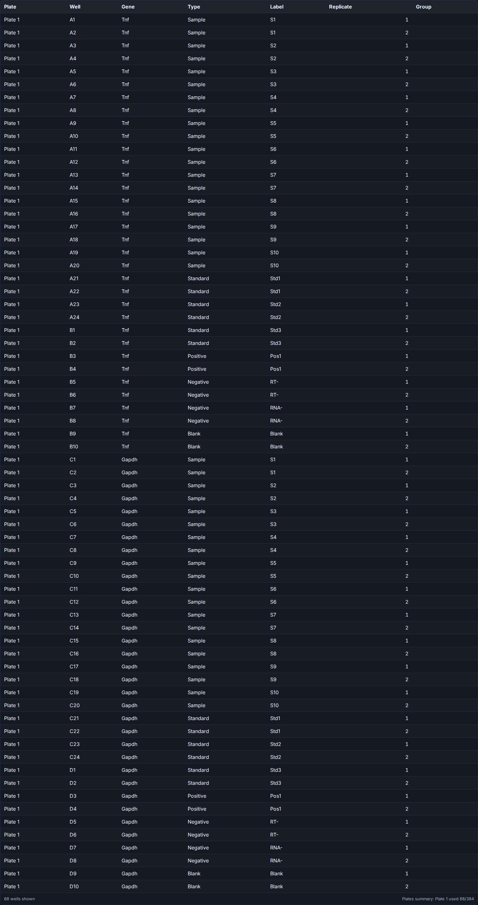
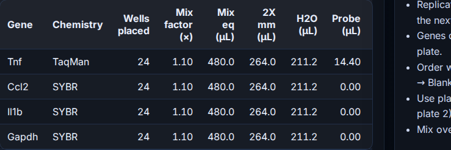

# qPCR Calculations (React + FastAPI)

Paste samples, pick genes/chemistry/replicates, add controls/overage, and get multi-plate 384-well layouts plus master-mix totals. Styling matches the timeline app’s dark Premiere-like look. Screenshots below come from a light Playwright capture (mocked backend, 10 samples, single plate) to keep the plate preview legible.

Latest captures (Playwright mock, 10 samples):

| App overview | Plate preview | Output table | Master mix | Notes |
| --- | --- | --- | --- | --- |
|  |  |  |  |  |

Run-through video:

<video src="screenshots/example_run.webm" controls width="820"></video>

## Highlights
- 384-well 16×24 grid; replicates stay adjacent in-row.
- Genes never split across plates; overflow moves the gene to the next plate. Optional per-gene plate overrides.
- Controls: standards, positives, RT−, RNA−, blanks; adjustable mix overage for master-mix only.
- Outputs: interactive table, TSV copy, CSV/Excel export hooks, per-gene master-mix volumes.

## Setup (D:)
```bash
cd "<PROJECTS_DIR>/qpcr-calculations-app-git/modern-app"
# If npm install fails on NTFS, run in WSL home and copy node_modules back.
npm install
python3 -m venv .venv
./.venv/bin/pip install --break-system-packages -r backend/requirements.txt
```

## Run (dev)
```bash
npm run dev:full   # front :5176, API :8003
```
Open http://localhost:5176 and click **Compute layout** (or mock `/plan` if you just want UI).

## Tests & screenshots
```bash
npx playwright install chromium   # once
npm run test:e2e                  # basic smoke
```
To regenerate the gallery with mocked `/plan`, start `npm run preview -- --host --port 5176` and run the Playwright snippet from the dev notes (routes `/plan` and saves into `screenshots/`).

## API
- `POST /plan` → layout[], mix[], summary[] (body includes samples, genes, controls, overage, overrides)
- `GET /health`
