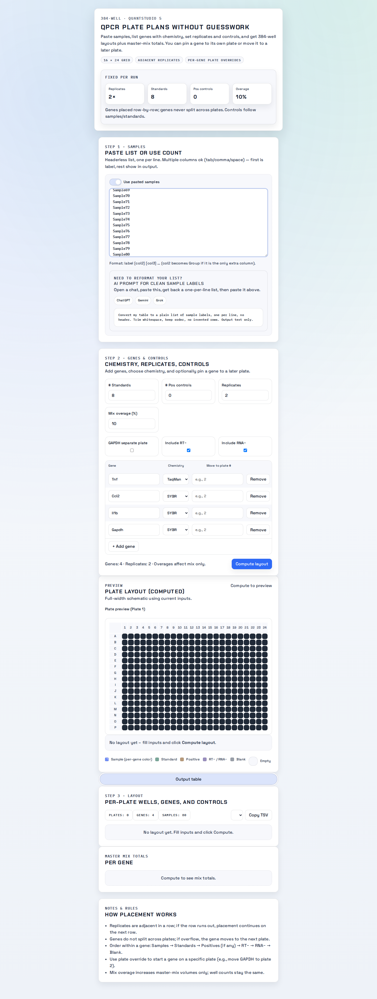

# qPCR Calculations (React + FastAPI)

Paste samples, pick genes/chemistry/replicates, add controls/overage, and get multi-plate 384-well layouts plus master-mix totals. Styling matches the lab notebook neo-brutalist system. Screenshots below come from a Playwright run (Dec 28, 2025) using 80 samples to force multiple plates; Plate 2 is selected in the preview.

Part of **Easylab Suite**: this repo is bundled as the **qPCR Planner** module (`qpcr-planner`).

License: All Rights Reserved.

Latest captures (Playwright run, 80 samples, multi-plate):

| Plan view | Plate preview | Output table | Master mix | Notes |
| --- | --- | --- | --- | --- |
|  |  |  |  |  |

Run-through video:

<video src="screenshots/example_run.webm" controls width="820"></video>

Extra captures (full-page + closeups): `screenshots/example_run.png`, `screenshots/layout_full.png`, `screenshots/plan_view.png`, `screenshots/plate_preview.png`.

## Highlights
- 384-well 16×24 grid; replicates stay adjacent in-row.
- Each gene uses its own plate (no shared plates). Optional per-gene plate overrides.
- Controls: standards, positives, RT−, RNA−, blanks; adjustable mix overage for master-mix only.
- Outputs: interactive table, TSV copy, CSV/Excel export hooks, per-gene master-mix volumes.
- Paste samples with multiple columns (tab/comma/space). First token is the label; all remaining columns render in the output table.

## Setup (D:)
```bash
cd "<PROJECTS_DIR>/qpcr-calculations-app-git/modern-app"
# If npm install fails on NTFS, run in WSL home and copy node_modules back.
npm install
python3 -m venv .venv
./.venv/bin/pip install --break-system-packages -r backend/requirements.txt
```

## Run (dev)
```bash
npm run dev:full   # front :5176, API :8003
```
Open http://localhost:5176 and click **Compute layout** (or mock `/plan` if you just want UI).

## Desktop Installer (Windows)
From the repo root (one level above `modern-app`):

```bash
npm install
npm run build:electron
```

The installer is generated in `desktop/dist/` as an `.exe` (NSIS). On first run, the app asks for storage folders and creates them for you.

Notes:
- The packaged app expects Python 3.10+ available on PATH to run the FastAPI backend. You can set `APP_PYTHON_PATH` to a specific Python executable if needed.
- The installer is unsigned unless code-signing credentials are configured.

## Data format & quick AI helper
- Simplest input: two-column CSV/TSV with headers `Sample, Conc` (ng/µL). The app also accepts wider tables; the first token per row becomes the label.
- To standardize quickly, use: [ChatGPT](https://chat.openai.com/), [Gemini](https://gemini.google.com/app), [Grok](https://grok.com/).
- Prompt: "Convert my table to CSV with headers: Sample, Conc. Keep values intact, no invented data, output UTF-8 CSV text only."
- Save as `samples.csv` and paste or upload. Visual helper: `screenshots/data-format-helper.svg`.

## Tests & screenshots
```bash
npx playwright install chromium   # once
npm run test:e2e                  # basic smoke
```
To regenerate the gallery with mocked `/plan`, start `npm run preview -- --host --port 5176` and run the Playwright snippet from the dev notes (routes `/plan` and saves into `screenshots/`).

## API
- `POST /plan` → layout[], mix[], summary[] (body includes samples, genes, controls, overage, overrides)
- `GET /health`
